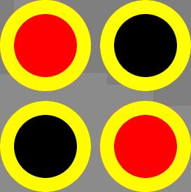

## Connect Four
- The game where you and your opponent try to line up four pieces in a line, column, or row first

# <a href='https://csalguera-connect-four.netlify.app/' target='_blank'> Launch Game</a>

### Features:
- Local Multiplayer
- Includes highlight animation when hovering over rows and columns:  

- Includes animation when pieces are placed:  

- Includes animation when game is reset:  

- Scoreboard to keep track of player 1 and 2 scores:  
 
- Includes audio controls to mute/unmute music or sfx:  
 
- Includes sound effects when placing pieces, hovering, and when game is reset
- Includes background music, [attributed below](#attributions)

### Technologies Used:
- HTML
- CSS
- Javascript

### Next Steps:
- make highlight animation dynamic by highlighting lowest unocuppied row in a given column
- implement AI
- implement menu with options:
  - display menu on bootup
  - option for local multiplayer
  - option for ai
  - option for audio

### Attributions
- [Background Image](https://www.freepik.com/free-vector/gradient-grainy-gradient-texture_14485901.htm#query=background&position=11&from_view=keyword) from freepik
- [Background Music](https://www.no-copyright-music.com/) composed by Liborio Conti